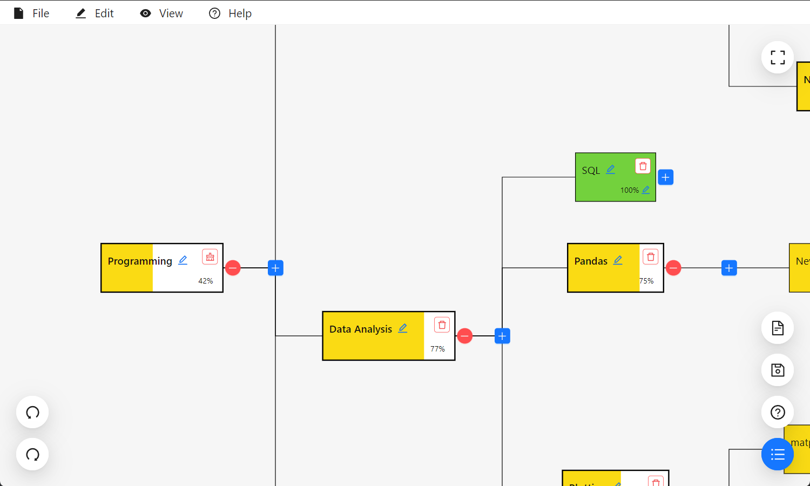
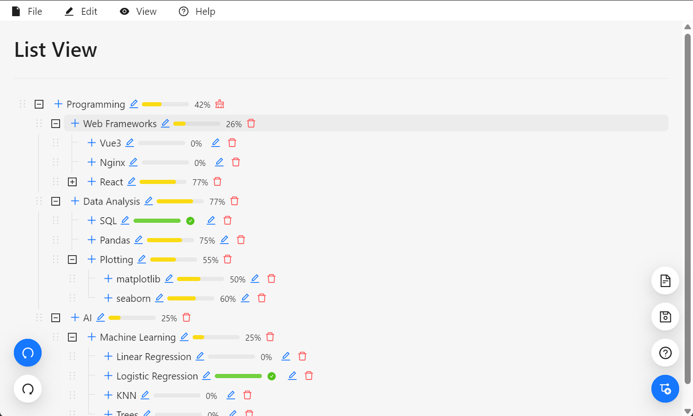

<div align="center">
  
</div>
<br/>

[](https://github.com/zydtiger/LearnForge)
[](https://github.com/zydtiger/LearnForge)
[](https://www.typescriptlang.org/)
[](https://opensource.org/licenses/MIT)

# LearnForge - Learning Goal Management and Logging App

LearnForge is a comprehensive app that empowers you to manage and track your learning goals with ease. This README file provides an overview of LearnForge, its features, and instructions for getting started. To install the app, refer to the [Installation Guide](#installation-guide).

## Table of Contents
- [LearnForge - Learning Goal Management and Logging App](#learnforge---learning-goal-management-and-logging-app)
  - [Table of Contents](#table-of-contents)
  - [Features](#features)
  - [Demo](#demo)
  - [Installation Guide](#installation-guide)
    - [Windows](#windows)
    - [Linux](#linux)
      - [Tauri](#tauri)
      - [Web App](#web-app)
    - [Mac](#mac)
      - [Tauri](#tauri-1)
      - [Web App](#web-app-1)
  - [Getting Started](#getting-started)
    - [Tauri](#tauri-2)
    - [Web App](#web-app-2)
  - [Contributing](#contributing)
  - [Feedback and Issues](#feedback-and-issues)
  - [License](#license)

## Features

- **Skill Tree Visualizer**: LearnForge features a captivating "skill tree" interface, reminiscent of tech trees in games like Stellaris. This visual representation allows you to organize and track your acquired skills under different categories, such as software, hardware, machine learning, and more.

- **Goal Management**: With LearnForge, you can define your goals for skill acquisition. The app enables you to track progress and mark completed goals, facilitating efficient goal management.

- **Logging Progress**: Keep a record of your learning journey by logging your progress. LearnForge allows you to add notes, milestones, and achievements in markdown format, providing a comprehensive overview of your process.

- **Category-based Organization**: Categorize your skills based on different domains, such as programming languages, frameworks, or specific areas of expertise. This categorization simplifies navigation and enables you to focus on specific skill sets.

- **Cross-Platform Compatibility**: LearnForge is built using Tauri, React, and TypeScript (ts). This technology stack ensures cross-platform compatibility, allowing you to run the app locally on various operating systems.

## Demo



## Installation Guide

### Windows

Navigate the the releases page and download the latest installer.

### Linux

#### Tauri

> Not tested

Follow the [Getting Started](#getting-started) tauri section and run `yarn tauri build`. Refer to [Tauri Linux Bundle](https://tauri.app/v1/guides/building/linux/).

#### Web App

Follow the [Getting Started](#getting-started) web app section and run `sudo ./src-web/install_linux.sh` after verifying with `./src-web/serve_prod.sh`. Run `sudo ./src-web/uninstall_linux.sh` to uninstall.

### Mac

#### Tauri

> Not tested

Follow the [Getting Started](#getting-started) tauri section and run `yarn tauri build`. Refer to the [Tauri macOS Bundle](https://tauri.app/v1/guides/building/macos).

#### Web App

> Not tested

Follow [Linux Web App](#web-app) instructions. However, there is no install script available for MacOS yet. To serve the web app locally, just use `./src-web/serve_prod.sh`.

## Getting Started

### Tauri

To run LearnForge locally on your machine, follow these steps:

1. **Install Environment**: Start by installing the [latest Node.js LTS](https://nodejs.org/en) and the [latest Rust](https://www.rust-lang.org/). Verify that your installation is successful by typing the following.

    ```
    > cargo --version
    cargo 1.77.1 (e52e36006 2024-03-26)
    > node -v
    v20.12.1
    ```  

2. **Install Tauri Prerequisites**: You may need to install platform-specific webviews. This is because Tauri uses the system webview for better performance and memory-optimization. Refer to this guide to install the correct one for your platform [Prerequisites](https://tauri.app/v1/guides/getting-started/prerequisites).

3. **Clone the Repository**: Start by cloning the LearnForge repository to your local machine using the following command:
   ```
   > git clone https://github.com/zydtiger/LearnForge.git
   ```

4. **Install Dependencies**: Navigate to the project directory and install the necessary dependencies by running the following command:
   ```
   > cd LearnForge
   > yarn
   ```

5. **Run the App**: Once the installation is complete, you can launch LearnForge by executing the following command:
   ```
   > yarn tauri dev
   ```

6. **Access LearnForge**: The LearnForge app should pop up automatically with the correct setup. You can now begin managing your learning goals and exploring the skill tree interface.
   - In case something like this pops up, change the `scripts:dev` in `package.json` to `vite --port=<available port>` and `build:devPath` in `src-tauri/tauri.conf.json` to `http://localhost:<your port>`.
    ```
    error when starting dev server:
    Error: listen EACCES: permission denied ::1:1420
      at Server.setupListenHandle [as _listen2] (node:net:1880:21)
      at listenInCluster (node:net:1945:12)
      at GetAddrInfoReqWrap.doListen [as callback] (node:net:2109:7)
      at GetAddrInfoReqWrap.onlookup [as oncomplete] (node:dns:109:8)
    ```

7. **Building the App**: Once you have tested LearnForge works as expected, you may proceed to building the App yourself.
    ```
    > yarn tauri build
    ```

### Web App
1. **Install Environment**: You only need to install the [latest Node.js LTS](https://nodejs.org/en). Verify that your installation is successful by typing the following.
    ```
    > node -v
    v20.12.1
    ```

2. **Clone the Repository**: Clone the LearnForge repository to your local machine using the following command:
    ```
    > git clone https://github.com/zydtiger/LearnForge.git
    ```

3. **Install Dependencies**: Navigate to the project directory and install the necessary dependencies by running the following command:
    ```
    > cd LearnForge
    > yarn
    ```

4. **Run the App**: Once the installation is complete, you can launch LearnForge by executing the following command:
    ```
    > yarn dev
    ```

5. **Test App in Production**: You can launch the production version of the app by executing the following:
    ```
    > chmod +x ./src-web/serve_prod.sh
    > ./src-web/serve_prod.sh
    ```
The script automatically builds the app to `./dist/` with `yarn build`.


## Contributing

When contributing to this repo, first fork your own repo and merge through PR.

## Feedback and Issues

If you encounter any issues, have suggestions for new features, or need assistance, please submit a github issue. We will get it fixed ASAP.

## License

LearnForge is released under the [MIT License](https://raw.githubusercontent.com/zydtiger/LearnForge/dev/LICENSE).